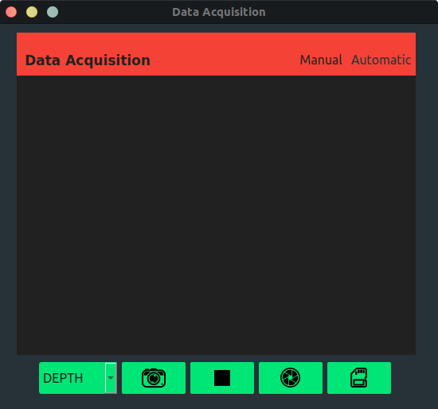
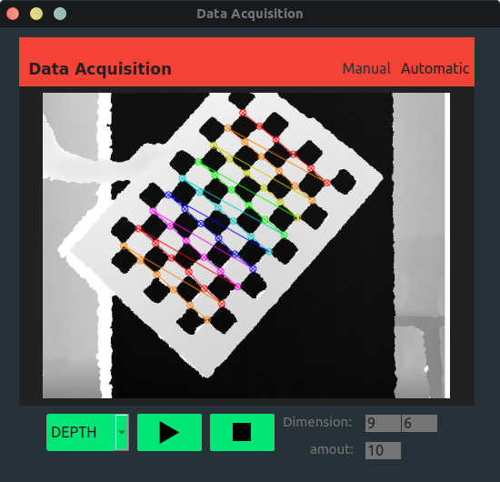

# **Image Acquisition for Intrinsic Calibration**

This is a simple desktop application for image acquisition for intrinsic calibration using python. This app  works with three cameras: RGB camera, depth camera and a thermal camera. With this app you can manually and automatically save the images for which the pattern is detected.

The main file returns a PySide Widget that can be used in another PySide application

## Manual Acquisition


## Automatic Acquisition


## Dependencies
This project needs **[libfreenect](https://github.com/OpenKinect/libfreenect)** on your computer to enter the microsoft kinect camera. If you are using a different camera you need to modify the file **src/ models/DataAcquisition.py** and ready, you can use the app.

## Project Setup
```
    pip install -r requirements.txt
```
## Run Project
```
    python IntrinsicAcquisitionWidget.py
```

